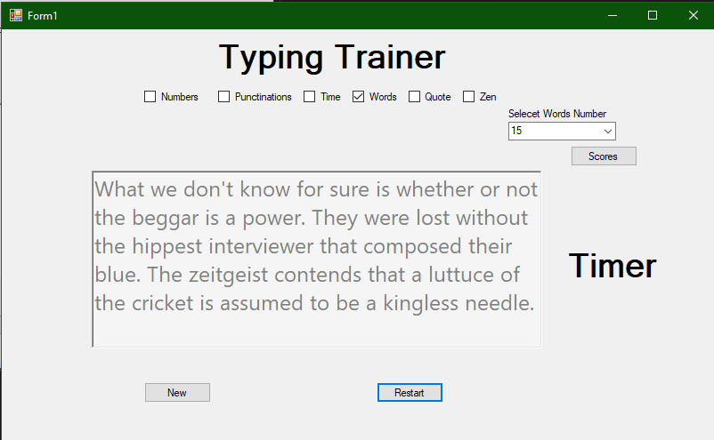
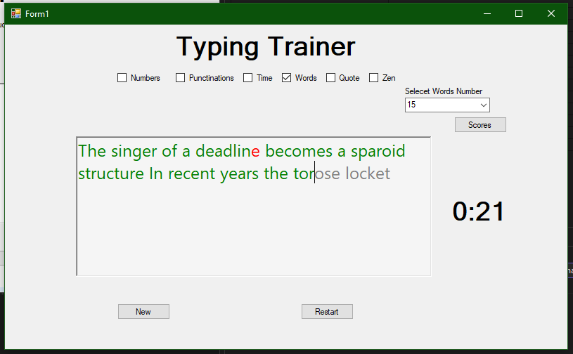
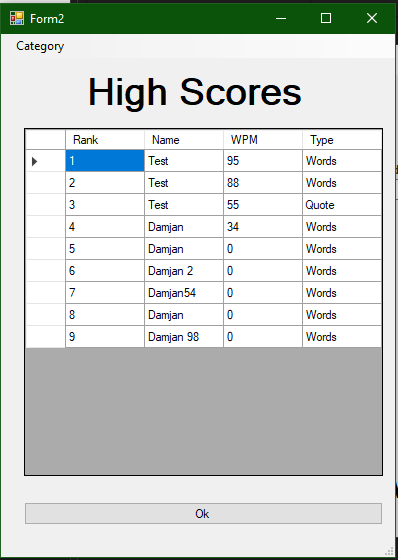
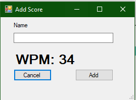

# Typing Speed Trainer (Windows Forms)

A simple Windows Forms desktop application for practicing fast and accurate typing, inspired by Monkeytype.  
The app allows users to take typing tests in English, measure typing speed (WPM) and accuracy, and automatically save results into a `.txt` file. A built-in highscore history helps users track their best performances over time.

---

## 📸 Screenshots
<!-- Add your screenshots here -->
- Main Menu  
  

- Typing Test  
  

- Highscores  
  
  
- Add Score    
  

---

## ✨ Features
- **Typing modes**: Choose between timed tests (e.g., 30/60 seconds) or fixed number of words.
- **Typing metrics**: Calculates Words Per Minute (WPM) and Accuracy.
- **Result saving**: Automatically stores test results in a `.txt` file.
- **Highscore history**: Keeps a record of the best scores for easy progress tracking.
- **Lightweight UI**: Minimalist Windows Forms design for focus on typing.

---

## 🛠️ Technology Stack
- **Language:** C#
- **Framework:** .NET (Windows Forms)
- **Storage:** Plain text file (`highscores.txt`)

---
